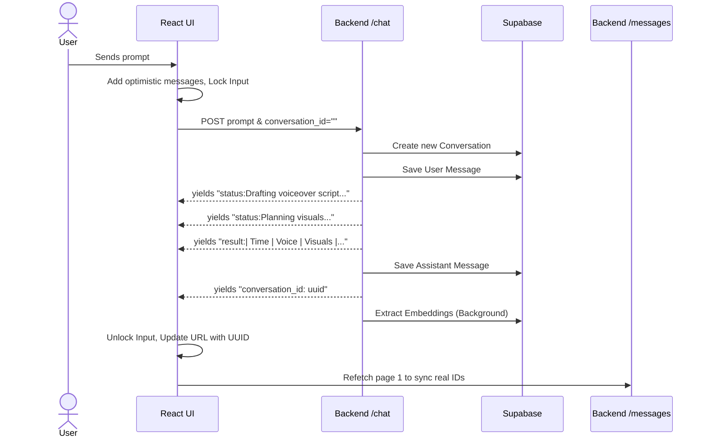
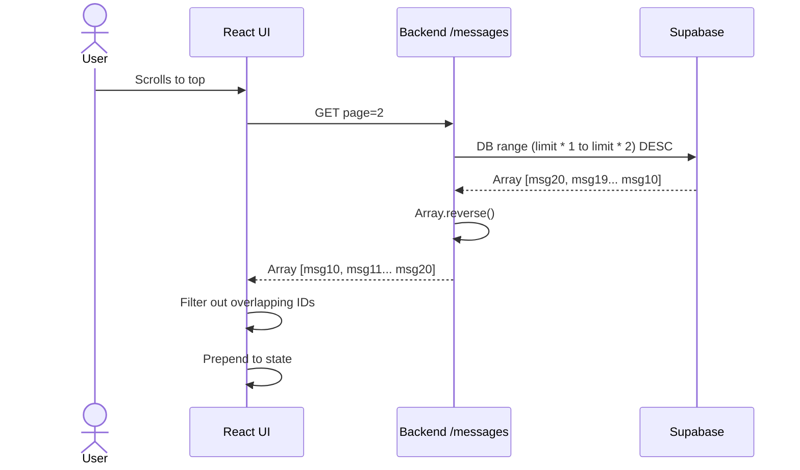

# Backend Walkthrough & Frontend API Contract

This report provides a strict API contract, behavioural analysis, and integration guide for the FastAPI backend system.

---

## 1. Endpoint Breakdown

| Method | Endpoint | Description | Content-Type |
| --- | --- | --- | --- |
| `POST` | `/chat` | Core generation and editing stream. | `multipart/form-data` |
| `GET` | `/messages` | Fetch paginated chat history. | `application/json` |
| `GET` | `/conversations` | List user conversations. | `application/json` |
| `GET` | `/conversations/{id}` | Fetch conversation + summary. | `application/json` |
| `DELETE` | `/conversations/{id}` | Archive conversation. | `application/json` |
| `POST` | `/research` | Generate a research brief. | `multipart/form-data` |
| `POST` | `/edit` | Independent lightweight text edit. | `multipart/form-data` |
| `POST` | `/feedback` | Submit rating for training data. | `multipart/form-data` |

### **`POST /chat`** (Streaming)
**Inputs (`multipart/form-data`):**
- `prompt` (string, optional): User's request or script instruction.
- `conversation_id` (string, optional): Pass to continue an existing session. If omitted or empty, backend creates a new one.
- `client`, `business_unit`, `video_type`, `video_tone`, `duration` (strings, optional): Strategy metadata.
- `research_id` (string, optional): Preferred method to link a previously generated research brief.
- `research_brief` (string JSON, optional): Fallback raw JSON of research brief.
- `user_id` (string, optional): Defaults to an internal anonymous UUID if not provided/invalid.
- `debug` (boolean, optional): Returns trace payloads in stream.
- `files` (Array of files, optional): Media or documents.

**Outputs (Text Stream):**
- A series of text prefixes (see "Streaming Protocol Analysis").

### **`GET /messages`**
**Inputs (Query String):**
- `conversation_id` (string): The current session ID (also accepts backward-compat `chat_id`).
- `page` (int, default: 1): 1-indexed page.
- `limit` (int, default: 20): Items per page. Max 100.

**Outputs (JSON):**
Returns `{ "messages": [...], "page": 1, "limit": 20, "has_more": true }`.
*Note:* Messages are fetched descending (newest first) from the DB, but reversed before returning so that the response array is always ordered **oldest → newest**.

### **`POST /research`**
**Inputs (`multipart/form-data`):**
- `prompt`, `client`, `business_unit`, `video_type`, `video_tone`, `duration`, `files`.
**Outputs (JSON):**
Returns `{ "success": true, "research": {...}, "research_id": "abc123xyz...", "error": null }`

---

> [!WARNING]
> ## 2. Streaming Protocol Contract (CRITICAL)
> The `/chat` endpoint stream **DOES NOT emit token-by-token text.** 
> It emits full-stage updates. The final script is delivered in one giant chunk. 
>
> ### Stream Prefixes
> 1. `status: {message}\n` (e.g. `status:Drafting voiceover script...`) - Use to update a loader UI.
> 2. `error: {message}\n` - Stage failure. Stop generation.
> 3. `result: {full_script}\n` - The COMPLETE generated text/markdown table.
> 4. `conversation_id: {uuid}\n` - Emitted near the **END** of a successful stream.
> 5. `debug: {json}\n` - Only if `debug=true`.
>
> ### 🔴 Parsing Risk: Multi-line Result Chunk
> The `result:` payload often contains a **Markdown Table with internal newlines (`\n`)**. 
> If your frontend strictly splits the stream using `.split('\n')` or `readline()`, **you will corrupt the markdown table**. 
> 
> **Correct Parsing Strategy:**
> Maintain a buffer of the stream. Look for `\n` ONLY when extracting known `status:`, `error:`, and `conversation_id:` tags. When you encounter `result:`, treat the *entire rest of that block* as the markdown content, preserving its internal newlines.

---

> [!TIP]
> ## 3. Data Flow & State Management
> **Source of Truth:** Supabase is the single source of truth. There is no in-memory cache.
>
> 1. **Message Write Timing:**
>    - The user's input is saved immediately **BEFORE** generation starts.
>    - The assistant's `result:` is saved **AFTER** it is fully generated.
>
> 2. **`conversation_id` Lifecycle:**
>    - If the frontend passes `conversation_id=""`, the backend generates a new UUID.
>    - The frontend will not know this ID until the `conversation_id:{uuid}\n` chunk arrives at the end of the stream.
>
> 3. **Background Tasks:**
>    - Vector embeddings, summarization, and auto-titling are triggered as non-blocking background tasks *after* the assistant message is saved. Do not block the UI waiting for titles.

---

## 4. Pagination Contract (`/messages`)

If you implement "infinite scroll up" to load history, you must account for DB offset shifts.

1. **Ordering:** 
   - `page=1` fetches the **NEWEST** `limit` messages in the DB.
   - The array returned is sorted **Oldest -> Newest** internally.
2. **The Shift Bug Risk:**
   - Offset is `(page - 1) * limit`.
   - If the user generates a new message while you are viewing history, the offsets shift by +2 (User message + Assistant message).
   - If you subsequently fetch `page=2`, you will fetch duplicate messages that you already received on `page=1`.
3. **`has_more` Logic:** 
   - `has_more` is strictly `length of items returned == limit`. 

**Frontend Mitigation:** Always deduplicate incoming messages by `id` when appending historical pages.

---

## 5. Research Flow Contract

The research workflow relies on a short ID caching mechanism in the DB:

- **Step 1:** Frontend calls `/research`.
- **Step 2:** Backend runs searches and stores the brief in Supabase `research_briefs` table with a `research_id`. Returns this ID to frontend.
- **Step 3:** Frontend calls `/chat` passing `research_id=123`.
- **Step 4:** Backend looks up `123` in DB. 
- *(Fallback)*: If `research_id` fails or isn't passed, but `research_brief` (a stringified JSON object) is passed, the backend attempts to parse it. **Never rely on the fallback**; stringified JSON form fields can get truncated by proxies/curl. Always use `research_id`.

---

> [!CAUTION]
> ## 6. Frontend Integration Risks (Summary)
>
> 1. **Mangled Markdown Tables:** Splitting stream strictly by `\n` will break table formatting.
> 2. **Zombie Sessions (Forking):** Because `conversation_id` is returned at the *end* of the stream, if a user sends a second message before the first stream finishes, the frontend sends `conversation_id=""` again. The backend will create a **second, separate conversation.** *Frontend MUST disable the input field during generation until `conversation_id` is received.*
> 3. **UI Message Duplication:** The backend generates random UUIDs for messages. The frontend cannot pre-generate an ID to sync with the backend. Therefore, when the stream ends and you fetch `/messages`, your local optimistic UI message will not ID-match the backend DB message. You must wipe local specific session state and perform a clean fetch of `/messages` upon stream completion, or deduce identity.
> 4. **Default User ID:** If `user_id` form field is invalid or missing, it defaults to a hardcoded UUID (`77ac3136...`). This means all testing sessions without a valid UUID will bleed into the same user bucket.

---

## 7. Frontend Contract Spec

When building the Chat/Integration logic, ensure the following steps:

```typescript
// 1. Sending a Message
const formData = new FormData();
formData.append('prompt', userInput);
if (currentConversationId) {
    formData.append('conversation_id', currentConversationId);
}

// 2. Stream Processing (Pseudo-logic)
let accumulatedScript = "";
for await (const chunk of stream) {
    if (chunk.startsWith('status:')) {
        updateProgressUI(chunk.replace('status:', ''));
    } 
    else if (chunk.startsWith('conversation_id:')) {
        currentConversationId = chunk.replace('conversation_id:', '').trim();
        updateUrl(currentConversationId);
    }
    else if (chunk.startsWith('error:')) {
        showErrorToast(chunk);
    }
    else if (chunk.startsWith('result:')) {
        // Because result spans newlines, we take the prefix off,
        // and allow newlines inside the markdown explicitly.
        accumulatedScript = chunk.replace(/^result:/, '');
        renderMarkdown(accumulatedScript);
    }
}

// 3. Post-Stream Verification
// Wipe optimistic UI messages, fetch hard source of truth
const history = await fetch(`/messages?conversation_id=${currentConversationId}&page=1`);
setMessages(history.messages);
```

---

## 8. Sequence Diagrams

### A. Normal Chat Generation


### B. Pagination Flow


---

## 9. Backend Edge Cases 

1. **Empty Prompts:** Allowed by API, but will likely result in poor generations unless using contextual edits (where LLM infers intent from past context).
2. **Incomplete Generations (Server Crash):** If the backend crashes mid-generation, `user` message is saved, but `assistant` message is not, leaving the conversation lopsided.
3. **Invalid `research_id`:** Will fail silently on lookup and fall back to `research_brief`. If both fail, generation proceeds via base pipeline without project facts.
4. **Keyword Intent Detection Removed:** The backend NO LONGER uses rules (`make it`, `shorter`) to determine "Edit" vs "Generate". It sends the entire chat history to a base prompt, letting the LLM decide naturally if it is an edit or new instruction. All edits now depend entirely on LLM reasoning based on context assembly.
